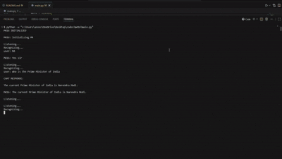
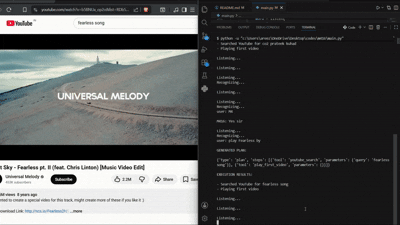

# M416 — Voice Controlled AI Desktop Assistant

M416 is a modular voice-controlled AI desktop assistant built using Python, Ollama, Playwright, SQLite, and local automation tools.

It combines conversational AI, browser automation, tool-based execution, persistent memory, voice interaction, runtime browser awareness, and multi-step command chaining.

---

## Demo

### Full Project Demo on Youtube

[](https://youtu.be/xwRPQO3TB-s)

---

### Browser Automation

Voice Command:

```
"Open YouTube and play Lost Sky by NCS"
```



---

### Persistent Memory

Voice Commands:

```
"Remember that my keys are in the third drawer"
"Where did I keep my keys?"
```


---

### Browser Interaction

Voice Command:

```
"Click on sign in"
```



---

## Features

### Voice Interaction

* Wake-word based activation
* Continuous speech recognition
* Real-time spoken responses
* Fully hands-free interaction workflow

### Multiple Chained Commands

* Execute multi-step workflows from a single voice command
* Chain browser actions, application control, and memory retrieval
* Natural language → structured tool execution pipeline
* LLM-generated JSON execution planning using Ollama + Qwen 2.5

### Tool-Based Execution Architecture

* Modular planner-validator-executor pipeline
* Centralized tool registry and management
* Execution validation before tool invocation
* Safe and deterministic AI-driven operations

### Browser Automation & Context Awareness

* Open and control websites
* Search and automate YouTube playback
* Click webpage elements and type text
* Extract webpage content dynamically
* Runtime browser context awareness
* Access current URLs, page titles, and clickable elements

### System Automation

* Open desktop applications
* Execute web searches
* Volume and media playback control
* Keyboard interaction automation

### Persistent Contextual Memory

* Store and recall user-defined information
* SQLite-backed long-term memory storage
* Natural language contextual memory retrieval

### Conversational AI

* Local LLM-powered assistant responses
* Voice-optimized short-form replies
* Fully local inference using Ollama + Qwen 2.5

## Architecture

```text
User Voice
    ↓
Speech Recognition
    ↓
main.py
    ↓
Router
    ↓
 ┌───────────────┬────────────────┐
 │               │                │
TOOL           CHAT          MEMORY
 │               │                │
Planner       chat.py        memo.py
 │
Validator
 │
Executor
 │
Registry
 │
Tool Functions
 │
Browser / System / Memory Actions
```

---

## Project Structure

```text
m416/
│
├── ai/
│   ├── chat.py
│   └── llm.py
│
├── browser/
│   ├── browser_agent.py
│   ├── browser_manager.py
│   └── runtime_context.py
│
├── core/
│   ├── executor.py
│   ├── planner.py
│   ├── registry.py
│   ├── router.py
│   └── validator.py
│
├── memory/
│   ├── memo.py
│   └── memory.db
│
├── system/
│   ├── system_tools.py
│   └── voice.py
│
├── main.py
├── requirements.txt
└── README.md
```

---

## Tech Stack

| Component          | Technology        |
| ------------------ | ----------------- |
| Language           | Python            |
| Local AI Runtime   | Ollama            |
| LLM Model          | Qwen 2.5 3B       |
| Browser Automation | Playwright        |
| Memory Storage     | SQLite            |
| GUI Automation     | PyAutoGUI         |
| Speech Recognition | SpeechRecognition |
| Text-to-Speech     | Windows SAPI      |

---

## How It Works

### 1. Wake Word Detection

The assistant continuously listens for the wake word:

```
M4
```

### 2. Intent Classification

The command is classified into one of:

- `TOOL` request
- `CHAT` request

### 3. Planning

If the request requires actions, the LLM generates a structured execution plan.

**Example:**

```json
{
  "type": "plan",
  "steps": [
    {
      "tool": "youtube_search",
      "parameters": {
        "query": "wavy karan aujla"
      }
    }
  ]
}
```

### 4. Validation

The execution plan is validated for:

- Tool existence
- Parameter structure
- Plan format

### 5. Execution

Validated steps are executed dynamically using the tool registry.

---

## Example Commands

### Browser Automation

```
Open YouTube
Search Karan Aujla on YouTube
Play the first video
What clickable elements are on this page?
```

### System Automation

```
Increase volume
Decrease volume
Pause media
Open Chrome
Open VSCode
```

### Memory

```
Remember my keys are on the desk
Where did I keep my keys?
```

### Conversational

```
Who is the president of USA?
What is the square root of 331?
Explain black holes briefly
```

---

## Design Highlights

### Structured AI Execution Pipeline

Natural language voice commands are converted into structured JSON execution plans using Ollama + Qwen 2.5, enabling deterministic AI-driven task execution instead of direct raw LLM actions.

### Multi-Step Chained Workflows

The assistant can autonomously orchestrate chained multi-tool workflows from a single utterance, including browser navigation, YouTube automation, application control, and contextual memory retrieval.

### Planner–Validator–Executor Architecture

A modular planner-validator-executor pipeline ensures all AI-generated execution plans are structurally validated before tool invocation for safe and controlled system operations.

### Centralized Tool Orchestration

All capabilities are exposed through a centralized tool registry, allowing dynamic tool execution, modular extensibility, and controlled orchestration of browser, memory, and system actions.

### Runtime Browser Context Awareness

The assistant maintains live browser awareness through Playwright, enabling execution-time interaction with current URLs, page titles, clickable elements, and active webpage state.

### Persistent Contextual Memory

SQLite-backed persistent memory enables natural language storage and retrieval of contextual user information across interactions.

### Persistent Browser Sessions

A centralized `BrowserManager` maintains shared Playwright browser sessions across commands, preserving runtime browser state between interactions.

### Fully Local AI Inference

The entire assistant runs locally using Ollama and Qwen 2.5 with zero external AI API dependencies.

---

## Setup

### 1. Clone Repository

```bash
git clone https://github.com/areez-dot-cse/M4-AI-Assistant.git
cd M4-AI-Assistant

```

### 2. Create Virtual Environment

```bash
python -m venv venv
```

### 3. Activate Virtual Environment

**Windows (Git Bash)**

```bash
source venv/Scripts/activate
```

**Windows (PowerShell)**

```powershell
.\venv\Scripts\Activate.ps1
```

### 4. Install Dependencies

```bash
pip install -r requirements.txt
```

### 5. Install Ollama

Download Ollama from [https://ollama.com](https://ollama.com), then pull the model:

```bash
ollama pull qwen2.5:3b
```

### 6 Install Playwright Browsers

```bash
playwright install
```

### 7. Run the Assistant

```bash
python main.py
```

---

## Usage

1. Say the wake word: **M4**
2. Then give a command naturally.
3. The assistant will either respond conversationally or create and execute a tool plan.

---

## Future Improvements

- Better browser reasoning
- Smarter multi-step planning
- Improved screen interaction
- Enhanced conversational memory
- Cross-platform support
- Authentication keyword for administrator tasks
---

## Disclaimer

This project is intended for educational and portfolio purposes.

---

## Author

**Areez**
